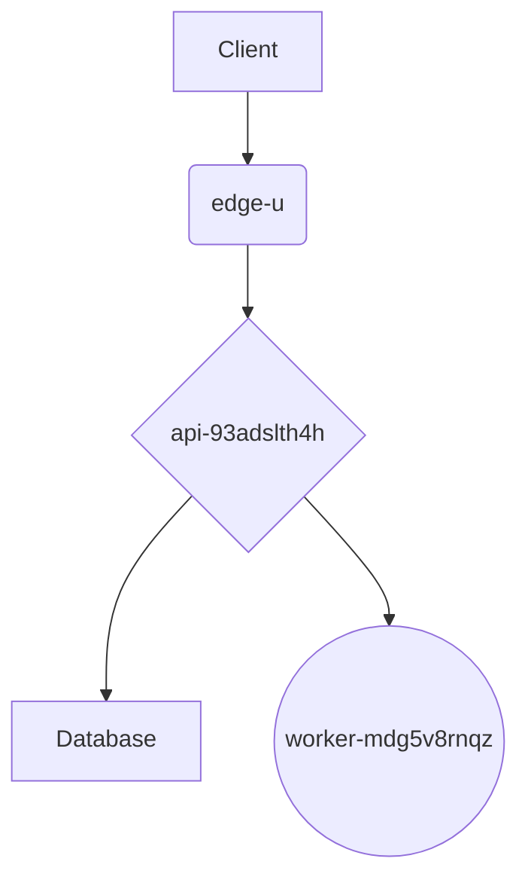

# 1. Author a deployment architecture markdown (0.75 Marks)

## 1. Problem Description

The task is to create a technical architecture document in Markdown format. This document should describe the deployment process of a data product from staging to production, covering components like an edge cache, API tier, and background workers. The document must adhere to a specific set of formatting and content requirements, including headings, diagrams, code snippets, and other GitHub Flavored Markdown (GFM) features.

## 2. Understanding the Requirements

Based on the email (`23f3004197@ds.study.iitm.ac.in`), the following specific values must be used in the Markdown file:

* **H1 Heading**: `Project qs4PQId-oEAt Deployment`
* **Project ID for `uv deploy`**: `qs4PQId-oEAt`
* **Mermaid Diagram Nodes**:
  * `edge-u`
  * `api-93adslth4h`
  * `worker-mdg5v8rnqz`
* **Footnote Reference**: `[^compliance-6w]`
* **Guardrail Token**: `mforpc7r-edure5jxer-9m8yabt`

Your Markdown must also include:

* At least two H2 (`##`) sections.
* Bold, italic, and strikethrough text.
* A hyperlink.
* A Markdown table.
* A GFM task list with both checked and unchecked items.
* A blockquote callout (`> [!NOTE]` or `> [!IMPORTANT]`) containing the guardrail token.

## 3. Step-by-Step Solution

1. **Create the Markdown File**: Create a new file named `architecture.md`.
2. **Add the H1 Heading**: Start the document with the required H1 heading.
3. **Write the Introduction**: Add a brief introduction. Weave in **bold**, *italic*, \~\~strikethrough\~\~ text, and a hyperlink.
4. **Create H2 Sections**: Add two sections, for example, `## Staging Environment` and `## Production Deployment`.
5. **Add the Mermaid Diagram**: Create a `mermaid` fenced code block showing the relationship between the edge, api, and worker nodes.
6. **Include the Deployment Command**: Add the inline code snippet `uv deploy qs4PQId-oEAt`.
7. **Add a Summary Table**: Create a Markdown table summarizing the service tiers.
8. **Create a Task List**: Add a GFM task list with deployment checklist items.
9. **Add the Guardrail Callout**: Write a blockquote using `> [!NOTE]` and include the guardrail token `mforpc7r-edure5jxer-9m8yabt`. Make sure to also include the footnote reference `[^compliance-6w]` in the body text.
10. **Define the Footnote**: At the end of the document, define the footnote `[^compliance-6w]:`.

## 4. Markdown File (`architecture.md`)

```markdown
# Project qs4PQId-oEAt Deployment

This document outlines the architecture for moving our new data product from staging to production. This process is **critical** for ensuring stability and performance. Our goal is to achieve a *zero-downtime* deployment. ~~Legacy deployment scripts~~ have been deprecated. For more details, you can visit the [official deployment guide](https://tds.s-anand.net/#/).

## Staging Environment

The staging environment is a mirror of production. All new features are tested here before release.

### Service Tiers

| Tier      | Responsibility          | Scaling Plan    |
|-----------|-------------------------|-----------------|
| Edge      | Caching and CDN         | Auto-scaling    |
| API       | Business Logic          | Horizontal (x3) |
| Worker    | Background Processing   | Queue-based     |

## Production Deployment

The production deployment follows a blue-green strategy.

### Architecture Diagram


### Deployment Steps

To ship the release, run the following command: `uv deploy qs4pqid-oeat`.

A final compliance check is mandatory before rolling out to all users.[^1]

### Pre-flight Checklist
  - [x] All unit tests passed.
  - [x] Integration tests are green.
  - [ ] Sign-off from the QA team received.
  - [ ] Final security scan completed.

> [\!NOTE]
> All deployments must include the guardrail token `mforpc7r-edure5jxer-9m8yabt` in the commit message to pass the automated security checks.
[^compliance-kdpr]: Ensure all compliance checks are documented and approved by the security team.


